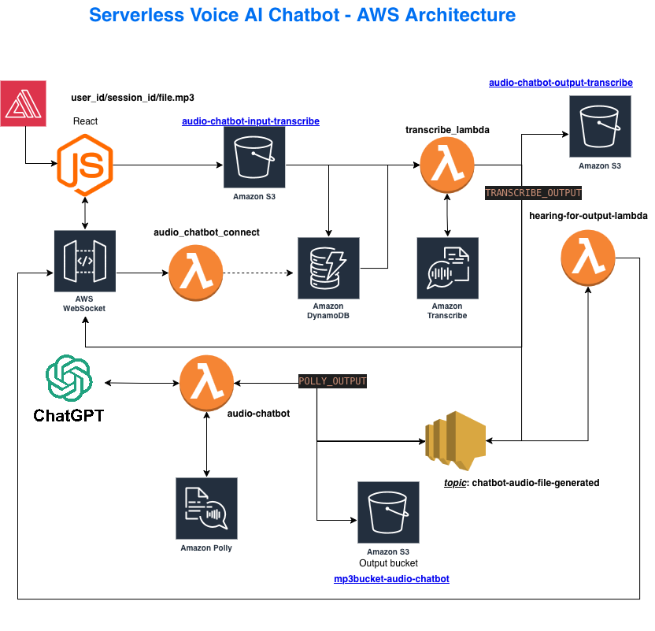

# Serverless Voice AI Chatbot

**A production-grade, cloud-native voice assistant built entirely on AWS serverless infrastructure**

Real-time voice conversations powered by 8 AWS managed services with zero server management.

---

## 🏗️ System Architecture

---

## 🎯 Project Overview

This project demonstrates cloud-native application design using AWS serverless services to process voice interactions in real-time. Users speak to a React frontend, their audio is processed through a fully asynchronous pipeline (transcription → AI generation → speech synthesis), and they receive spoken responses—all without managing a single server.

---

## 🔧 Technical Stack

### AWS Services (8)
- **API Gateway (WebSocket)** — Bidirectional real-time client-server communication
- **Lambda Functions (4)** — Event-driven compute:
  - `audio_chatbot_connect` — WebSocket connection management
  - `transcribe_lambda` — Orchestrates speech-to-text processing
  - `audio-chatbot` — ChatGPT API integration and response generation
  - `hearing-for-output-lambda` — Audio synthesis and delivery
- **S3 Buckets (3)** — Audio file storage:
  - `audio-chatbot-input-transcribe` — User voice uploads
  - `audio-chatbot-output-transcribe` — Transcription results
  - `mp3bucket-audio-chatbot` — Generated audio responses
- **DynamoDB** — Session state and conversation context management
- **Amazon Transcribe** — Speech-to-text conversion
- **Amazon Polly** — Text-to-speech synthesis
- **SNS** — Asynchronous message routing (topic: `chatbot-audio-file-generated`)

### External Services
- **ChatGPT API** — Natural language response generation

### Frontend
- **React** — User interface for voice recording and playback

---

## 🔄 Event-Driven Workflow

1. **User connects** → WebSocket connection established via API Gateway → `audio_chatbot_connect` Lambda stores session in DynamoDB
2. **User speaks** → React app uploads audio file to S3 (`audio-chatbot-input-transcribe`)
3. **Transcription** → S3 upload triggers `transcribe_lambda` → Amazon Transcribe converts speech to text → result stored in S3 (`audio-chatbot-output-transcribe`)
4. **AI Processing** → Transcription completion triggers `audio-chatbot` Lambda → calls ChatGPT API → receives text response
5. **Speech Synthesis** → `audio-chatbot` Lambda calls Amazon Polly → generates audio → stores in S3 (`mp3bucket-audio-chatbot`)
6. **SNS Notification** → Audio generation publishes to SNS topic (`chatbot-audio-file-generated`)
7. **Audio Delivery** → `hearing-for-output-lambda` subscribes to SNS topic → retrieves audio from S3 → sends to client via WebSocket

---

## 🎓 Key Learnings

### Cloud-Native Design Principles
- **Managed services over infrastructure** — Leveraged AWS-managed services to eliminate server provisioning, patching, and scaling concerns
- **Event-driven architecture** — Asynchronous workflows using S3 triggers, SNS pub/sub, and Lambda invocations
- **Loose coupling** — Each Lambda function has single responsibility, connected via events (not direct calls)

### Distributed Systems Challenges
- **State management** — DynamoDB stores session context for stateless Lambda functions
- **Asynchronous debugging** — CloudWatch logs across multiple services to trace event flows
- **Error handling** — Dead-letter queues and retry logic for failed Lambda invocations

### AWS-Specific Skills
- WebSocket API configuration for real-time bidirectional communication
- S3 event notifications triggering Lambda functions
- IAM roles and policies for service-to-service permissions
- CloudWatch for centralized logging and monitoring

---

## 💡 Why This Architecture?

**Serverless advantages demonstrated:**
- ✅ **Zero infrastructure management** — No servers to provision, patch, or scale
- ✅ **Pay-per-use** — Only charged for actual Lambda invocations and storage used
- ✅ **Auto-scaling** — Each service scales independently based on demand
- ✅ **High availability** — AWS-managed services provide built-in redundancy
- ✅ **Fast iteration** — Focus on business logic, not infrastructure

---

## 🚀 Future Enhancements

- Add CloudFormation/Terraform IaC templates for reproducible deployments
- Implement conversation history persistence in DynamoDB
- Add support for multiple languages via Transcribe/Polly
- Create CI/CD pipeline for automated testing and deployment
- Add API Gateway request validation and rate limiting

---

## 📚 Course Context

Built as final project for **Cloud Computing** course, demonstrating practical application of:
- Serverless architecture patterns
- Event-driven system design
- AWS service integration
- Real-time data processing
- Cloud-native application development

---

## 🏆 Technical Highlights

- **8 AWS services orchestrated** in production-like environment
- **Fully asynchronous pipeline** — no blocking operations
- **External API integration** with ChatGPT
- **Real-time WebSocket** communication
- **Pub/sub messaging** via SNS for decoupling
- **Stateless function design** with external state management
